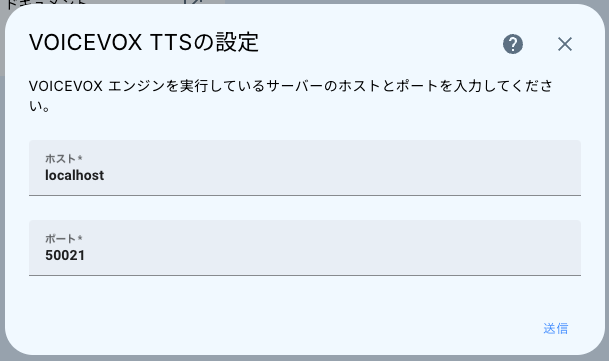
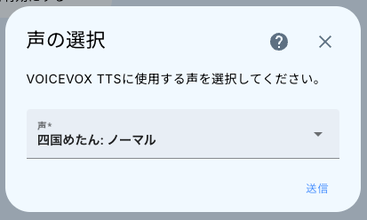
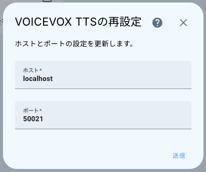
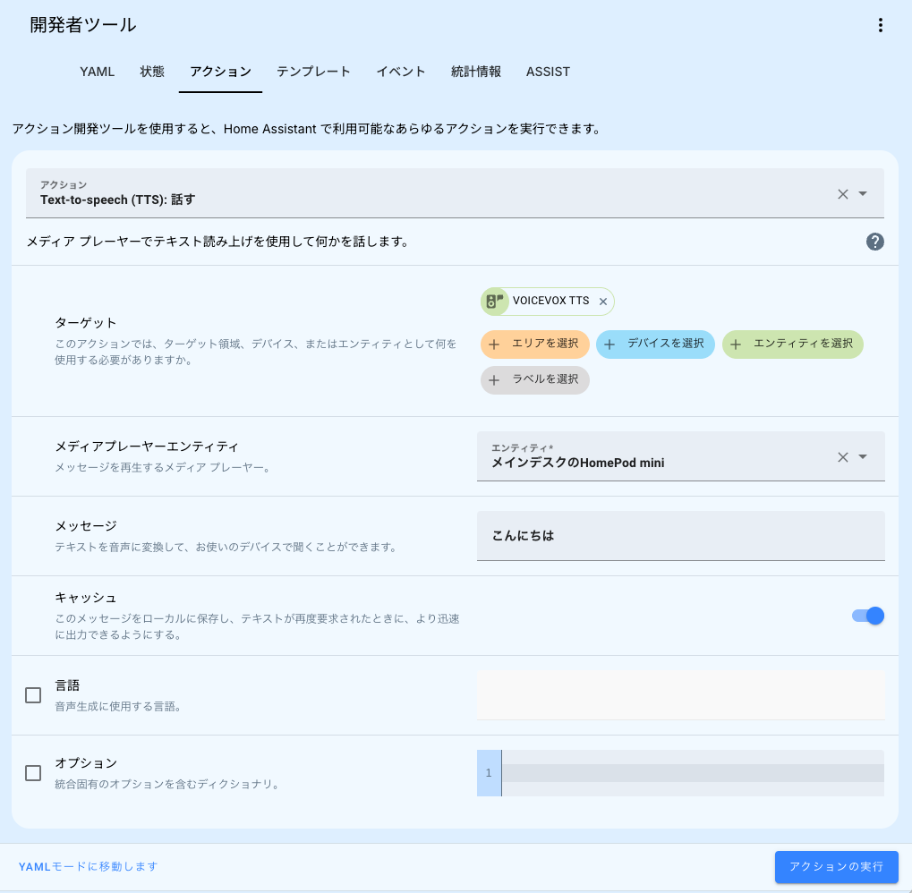
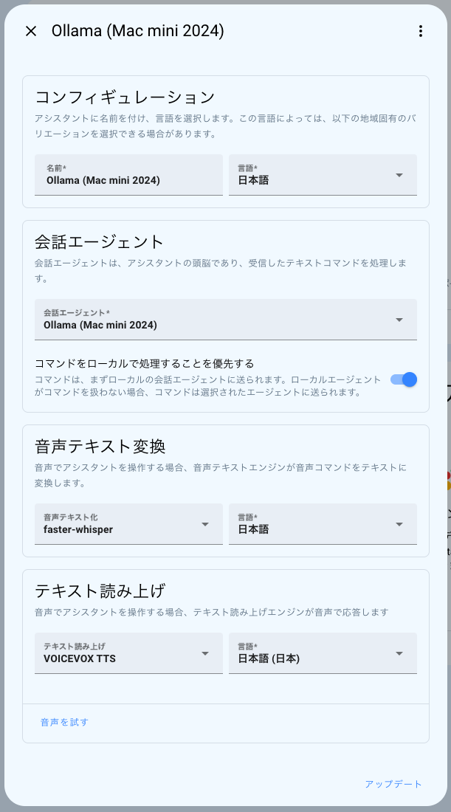

# VOICEVOX TTS統合 for Home Assistant
[English](/README.md) | **日本語**

このカスタム統合は、Home Assistantで[VOICEVOX](https://voicevox.hiroshiba.jp/)を使った、日本語のTTSサービスを提供します。

>[!NOTE]
>VOICEVOX TTSを使用するには、[VOICEVOX エンジン](https://github.com/VOICEVOX/voicevox_engine)を実行したサーバーが必要です。
>
>[VOICEVOX エンジンのアドオン](https://github.com/taikun114/Home-Assistant-VOICEVOX-Engine)もありますので、こちらを使うこともできます。

VOICEVOX TTSを利用する際は、[VOICEVOXの利用規約](https://voicevox.hiroshiba.jp/term/)および各キャラクターの利用規約を必ずご覧ください。

>[!NOTE]
>VOICEVOX APIと互換性のある日本語TTSエンジンの[AivisSpeech Engine](https://github.com/Aivis-Project/AivisSpeech-Engine)でも問題なく使用できることを確認しました。
>
>AivisSpeech Engineで使用する場合は、VOICEVOX TTS統合のセットアップ時に、AivisSpeech Engineを実行しているサーバーのホストとポートを入力してください。

## インストール
### HACS経由
HACS（Home Assistant Community Store）をご利用の場合、以下のボタンをクリックするか、手動でリポジトリを追加してインストールする必要があります。

手動で行う場合、サイドバーからHACSを開き、右上の`...`をクリックしたら`Custom repositories`を開きます。

カスタムリポジトリの画面が開いたら、以下のように入力してリポジトリを追加します。

- **Repository**: `https://github.com/taikun114/VOICEVOX-TTS-for-Home-Assistant`
- **Type**: `Integration`

リポジトリを追加できたら、`VOICEVOX TTS`が一覧に表示されるので、そこからインストールしてください。

### 手動
[最新のリリース](https://github.com/taikun114/VOICEVOX-TTS-for-Home-Assistant/releases/latest)をダウンロードし、ZIPファイルを展開します。

展開後、`custom_components/voicevox_tts`フォルダを、お使いのHome Assistantの`config/custom_components/`にコピーします。その後、Home Assistantを再起動します。

## 設定
VOICEVOX TTSは、UIから設定を行うことができます。

### 最初の設定

1. Home Assistantの`設定` → `デバイスとサービス`と進みます。
2. `統合を追加`をクリックし、`VOICEVOX TTS`と検索します。
3. VOICEVOX エンジンを実行しているサーバーのホストとポートを入力して`送信`をクリックします。

4. VOICEVOX TTSに使用する声を選択して`送信`をクリックします。

以上で設定は完了です。

### オプションの変更

オプションからは、VOICEVOX TTSに使用する声を変更することができます。

1. Home Assistantの`設定` → `デバイスとサービス`と進みます。
2. `VOICEVOX TTS`と検索してクリックします。
3. `設定`をクリックします。
4. VOICEVOX TTSに使用する声を選択して`送信`をクリックします。

以上でオプションの変更は完了です。

>[!NOTE]
>声を変更しても古い声が使用される（変更後の声が使用されない）場合、以前作成されたキャッシュが使用されている可能性があります。
>文章を変更するか、TTSのキャッシュをクリア（`tts.clear_cache`アクションを実行）する必要があります。

### 再設定

最初に設定した`ホスト`と`ポート`は、再設定から変更することができます。

1. Home Assistantの`設定` → `デバイスとサービス`と進みます。
2. `VOICEVOX TTS`と検索してクリックします。
3. `設定`の右にある`...`をクリックし、`再設定`をクリックします。
4. VOICEVOX エンジンを実行しているサーバーのホストとポートを入力して`送信`をクリックします。

以上で設定の変更は完了です。

## VOICEVOX TTSの使い方
### `メディア`から再生する

Home Assistantの`メディア`ページから任意のテキストを再生させることができます。

1. `メディア`ページを開きます。

   
2. `Text-to-speech` → `VOICEVOX TTS`と進みます。
3. `メッセージ`のところに再生したいテキストを入力し、`発言`をクリックします。

>[!TIP]
>テキストを再生する際、右下の`BROWSER`をクリックして再生デバイスを変更してから`発言`をクリックすることで、お好みのメディアプレイヤーでテキストを再生させることができます。

### アクションを使って再生する

`tts.speak`アクションを使って、お好みのメディアプレイヤーで任意のテキストを再生させることができます。もちろん、オートメーションに組み込んでテキストを再生させることも可能です。

### Assistで使う

Home Assistantの音声アシスタント「Assist」で使えるように設定すれば、Assistからの応答を、VOICEVOX TTSを使って聞くことができます。

1. Home Assistantの`設定` → `音声アシスタント`と進みます。
2. VOICEVOX TTSを使いたい音声アシスタントをクリックして設定画面を開きます。
3. `テキスト読み上げ`をVOICEVOX TTSのものに変更し、`アップデート`をクリックします。

>[!NOTE]
>`テキスト読み上げ`のところにVOICEVOX TTSが選択できない場合、`コンフィギュレーション`の言語が`日本語`になっていることをご確認ください。
>VOICEVOX TTSは日本語にのみ対応しているため、他の言語になっていると選択できません。